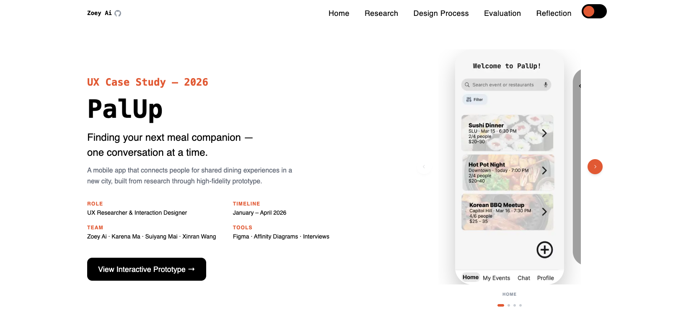
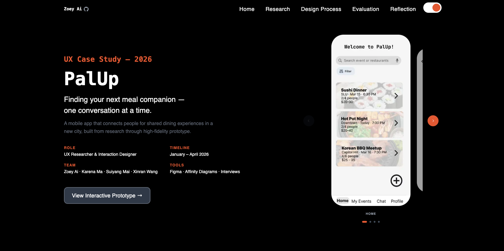

# PalUp — UX Case Study

A single-page UX portfolio case study for **PalUp**, a mobile app designed to help people find dining companions in a new city. Built with Astro 4 + Tailwind CSS and deployed to GitHub Pages.

**Live site:** https://zoeyai1221.github.io/palup.github.io/

| Light mode | Dark mode |
|:---:|:---:|
|  |  |

## Project

PalUp addresses the social isolation experienced by Chinese immigrants in Seattle who struggle to find compatible dining companions. The case study documents the full UX process — from user research through high-fidelity prototype — across five sections:

1. **The Problem** — Context and core insight
2. **Research** — 8 semi-structured interviews, affinity diagram, user persona
3. **Design Process** — Four iterative phases (paper prototype → wireframes → medium-fi → high-fi)
4. **Evaluation** — Two rounds of heuristic evaluation + think-aloud testing
5. **Reflection** — What worked, what we'd do differently, what's next

**Team:** Zoey Ai · Karena Ma · Suiyang Mai · Xinran Wang

**Timeline:** January – April 2026

**Course:** CS 5340 Human-Computer Interaction

## Tech Stack

- [Astro 4](https://astro.build/) — static site generator
- [Tailwind CSS](https://tailwindcss.com/) — utility-first styling
- `astro:assets` `<Image>` — optimized image pipeline (WebP conversion, hashed filenames)
- [astro-navbar](https://github.com/surjithctly/astro-navbar) — responsive nav
- GitHub Actions + GitHub Pages — CI/CD deployment

## Project Structure

```
/
├── .github/workflows/
│   └── astro.yml              # GitHub Pages deploy workflow
├── public/
│   └── favicon.svg
├── src/
│   ├── assets/images/palup/   # All case study images (optimized at build time)
│   ├── components/
│   │   ├── Navbar.astro
│   │   ├── Hero.astro         # Phone carousel (spring animation)
│   │   ├── About.astro        # 01 — The Problem
│   │   ├── Research.astro     # 02 — Research
│   │   ├── DesignProcess.astro # 03 — Design Process
│   │   ├── Evaluation.astro   # 04 — Evaluation
│   │   ├── Reflection.astro   # 05 — Reflection
│   │   └── ui/
│   ├── layouts/
│   │   └── Layout.astro       # Global styles, scroll-reveal observer
│   └── pages/
│       └── index.astro
├── astro.config.mjs
└── package.json
```

## Commands

Run from the project root:

| Command          | Action                                       |
| :--------------- | :------------------------------------------- |
| `yarn`           | Install dependencies                         |
| `yarn dev`       | Start dev server at `localhost:4321/palup.github.io/`         |
| `yarn build`     | Build production site to `./dist/`           |
| `yarn preview`   | Preview production build locally             |

## Deployment

Pushes to `main` automatically trigger the GitHub Actions workflow (`.github/workflows/astro.yml`), which builds the site with the correct `--base /palup.github.io/` path and deploys to GitHub Pages.

Images are processed at build time via Astro's `astro:assets` pipeline; converted to WebP with content-hashed filenames for correct path resolution on the subdirectory deployment.
